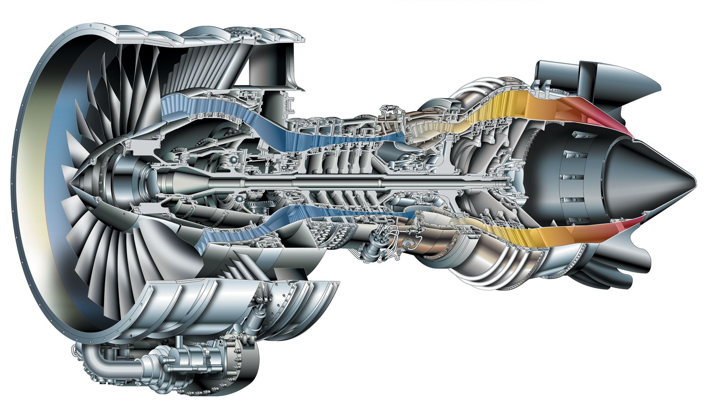

---
output:
  html_document: default
  pdf_document: default
---

# Turbofan Engine Remaining Useful Life
## Data Science Bootcamp
## Casptone Project

---



***

## Overview

The main goal of this document is to provide an approach to the implementaion of a model that can be use to predict the the Remaining Useful Life of a series of Jet Engines the dataset used for this project has been obtained from a NASA public available source [^1]  

The dataset consists in 3 diferent files:
- RUL_FD001.txt
- test_FD001.txt
- train_FD001.txt

In this dataset there are 100 Jet Engines, data has been collected using 21 diferent sensors located at the main components, each data collection is represented by a single use cycle. In the data has been collected for each engine from the first cycle until it reaches a failure, therefore the data in the train_FD001 file assumes that the last cycle listed per engine is the cycle when the engine suffered a major breakdown. Data is also complemented with 2 Operational Settings that are supposed to affect the engine performance.

In the test_FD001 file the data for operational settings and sensor is provided however the last cycle number doesn't represent the failure cycle, the real cycle number for each engine on the test set is provided by the file RUL_FD001. All engines are the same model.


***

#### Research Question
In the asset maintenance world predictive maintenance is gaining more importance because Implementing a predictive maintenance programs can result in:

- Savings of 30-40 percent
- 10-fold return on investment (ROI)
- Maintenance cost reduction of 25-30 percent
- Breakdown elimination of up to 75 percent
- Reduction in downtime from 35-45 percent
- Increase in production of 20-25 percent. A manufacturer has the ability to shift from reactive maintenance to dispatch a technician with a preventive maintenance work order on an 'as needed' basis and ensure that repair parts are in inventory prior to downtime [^2]


Given the data provided in the datasets, we'd like to create a model to predict the RUL (Remaining Useful Life). In consequence we will try to answer the following question:

> **Is it possible to predict the RUL of same model Jet Engines based on Operational Setting and sensor collected data?**

---
```{r setup, include=FALSE}
knitr::opts_chunk$set(echo = TRUE)
```

```{r Library Load, include=FALSE}
# Install Packages
#install.packages('corrplot')
#install.packages('psych')

# Load Libraries
library(tidyverse)
library(dbplyr)
library(lubridate)
library(data.table)
library(ggplot2)
library(repr)
library(caret)
library(chron)
library(gridExtra)
library(randomForest)
library(MLmetrics)
library(MASS)
library(ROCR)
library(pROC)
library(modeest)
library(corrplot)
library(psych)

print_metrics = function(lin_mod, df, score, label){
  resids = df[,label] - df[,score]
  resids2 = resids**2
  N = length(score)
  r2 = as.character(round(summary(lin_mod)$r.squared, 4))
  adj_r2 = as.character(round(summary(lin_mod)$adj.r.squared, 4))
  cat(paste('Mean Square Error      = ', as.character(round(sum(resids2)/N, 4)), '\n'))
  cat(paste('Root Mean Square Error = ', as.character(round(sqrt(sum(resids2)/N), 4)), '\n'))
  cat(paste('Mean Absolute Error    = ', as.character(round(sum(abs(resids))/N, 4)), '\n'))
  cat(paste('Median Absolute Error  = ', as.character(round(median(abs(unlist(resids))), 4)), '\n'))
  cat(paste('R^2                    = ', r2, '\n'))
  cat(paste('Adjusted R^2           = ', adj_r2, '\n'))
}
```

Loading Datasets and Formating columns

```{r Load and format datasets}
# Load Dataset for Study
test <- read_delim("test_FD001.txt", delim = " ", col_names = FALSE)
train <- read_delim("train_FD001.txt", delim = " ", col_names = FALSE)
CTF <- read_csv("RUL_FD001.txt", col_names = FALSE)

# Set header Names for Train set
names(train) <- c('UnitNum','TimeCycles','OperSet1','OperSet2','OperSet3','SensorRead01','SensorRead02','SensorRead03','SensorRead04','SensorRead05'
                  ,'SensorRead06','SensorRead07','SensorRead08','SensorRead09','SensorRead10','SensorRead11','SensorRead12','SensorRead13','SensorRead14'
                  ,'SensorRead15','SensorRead16','SensorRead17','SensorRead18','SensorRead19','SensorRead20','SensorRead21','CyclesToFail')

# Set header Names for Test set
names(test) <- c('UnitNum','TimeCycles','OperSet1','OperSet2','OperSet3','SensorRead01','SensorRead02','SensorRead03','SensorRead04','SensorRead05'
                 ,'SensorRead06','SensorRead07','SensorRead08','SensorRead09','SensorRead10','SensorRead11','SensorRead12','SensorRead13','SensorRead14'
                 ,'SensorRead15','SensorRead16','SensorRead17','SensorRead18','SensorRead19','SensorRead20','SensorRead21','CyclesToFail')

# Set header Names for RUL number applicable to Test set
names(CTF) <- c('CyclesToFail')

summary(train)
```
From the summary of the train data we can notice that:

- There are a few of the variables coming in the train data that won't add any value to the prediction mode and can be safely removed as described below.

    Section            | Variable     | Reason 
    ------------------ | ------------ | ----------------------------    
    Sensor Readings    | SensorRead01 | Value won't change over time
    Sensor Readings    | SensorRead05 | Value won't change over time
    Sensor Readings    | SensorRead10 | Value won't change over time
    Sensor Readings    | SensorRead16 | Value won't change over time
    Sensor Readings    | SensorRead18 | Value won't change over time
    Sensor Readings    | SensorRead19 | Value won't change over time
    Operating Settings | OperSet3     | Value won't change over time

A plot chart of the variables described above can be accessed by clicking in the links below:

[Plot of Sensor Reading Variables](https://public.tableau.com/profile/freddy.anato4039#!/vizhome/DataScience-Capstone/PlotofSensorReadings?publish=yes)

[Plot of Operational Seettings](https://public.tableau.com/profile/freddy.anato4039#!/vizhome/DataScience-Capstone/PlotofOperationSettings?publish=yes)

The initial variable reduction helps with the creation of a more fitted model which results benefitial as the inital model won't spend resources looking variables that won't produce valuable results.

Let's start by finding the last Cycle for each engine in the Train and Test set

```{r Last Cycle}
# Find the last Cycle number for each UnitNum (Jet Engine) in the Train set
TrainFailCycle <- as.vector(tapply(train$TimeCycles, train$UnitNum, max))

# Find the last Cycle number for each UnitNum (Jet Engine) in the Test set
TestFailCycle <- as.vector(tapply(test$TimeCycles, test$UnitNum, max))

# Plot Last Cycle per Unit
qplot(y= TrainFailCycle, x=1:length(TrainFailCycle), main = 'Failure Cycle by Engine', ylab = 'Cycle of Failure', xlab = 'Unit Number', geom = "line")
```

The plot above shows the last cycle for each Engine, showing the majority of failure cycles around the 150 to 200 mark and the histogram below confirms this observation

```{r}
# Show distribution of Failure Cycle in Engines
hist(TrainFailCycle)
```

In the process of preparing the data for the prediction model we need to consider the data provided in the test set. We have noticed that the Test data won't provide a value specifying the last cycle when the engine failed. 

*Why this value is important in the test set?*

Basically, since the prediction model will predict the number of the last cycle before the engine fail we need to have a comparison point between the train set and the test set. Prediction model will generate a Cycles-to-Fail value that needs to be compared to the real value to understand the accuracy and/of efficiency of the model and provide a base to calculate residuals.

Since this value was not provide we have a way to calculate them both for the Train and Test sets.

For the Train set, is assumed that the last cycle number in the data is the failure cycle hence we apply the max number of cycles by engine backwards so the value of "CyclestoFail" is 0 in the last cycle in the engine data.

For the Test set, we have the real RUL value provided in the RUL_FD001 file. We'll use this value to perform a calculation that will make that the "CyclestoFail" value on the last reported cycle by engine equals to the RUL value in the RUL file.

Once this process is completed well start evaluating and visualizing the correlation between the preliminary selected variables.

```{r Cycles to Fail and Correlations}

# Get RUL values for file 
RealCTF <- unlist(CTF)

# Calculate Cycles to Fails Value for Train Set
train$CyclesToFail <- TrainFailCycle[train$UnitNum] - train$TimeCycles

# Calculate Cycles to Fails Value for Test Set
test$CyclesToFail <-   RealCTF[test$UnitNum] + TestFailCycle[test$UnitNum]
test$CyclesToFail <-  test$CyclesToFail - test$TimeCycles

# Build the preliminary list of variables for the prediction model 
num_cols = c('OperSet1','OperSet2','SensorRead02','SensorRead03','SensorRead04','SensorRead06','SensorRead07','SensorRead08','SensorRead09',
             'SensorRead11','SensorRead12','SensorRead13','SensorRead14','SensorRead15','SensorRead17','SensorRead20','SensorRead21')


# Calculate Correlations between variables
correlations <- cor(data.frame(train[,num_cols]))

# Visualize correlations
corrplot(correlations)

``` 

In a continue effort to provide a better foundation for the creation of the prediction model, let's review a valiable heatmap and a clusterized version of the correlogram

```{r Heat Map & Clustered Correlogramn}
rev_correl <- cor(data.frame(train[,num_cols]))

heatmap(rev_correl, symm = TRUE)

corrplot(rev_correl, type = "upper",  order = 'hclust')
```

By looking at the charts above we can extract a couple of observations:

1. Variables OperSet1 & OperSet2 only have a correlation among each other but no visible correlation with the sensor collected values, we can safely affirm that these two variables can be removed.

2. Variable SensorRead06 has very weak correlation with any of the other variables in the study, this can also be safely removed

In conclusion, by looking at the plots from all Variables and combining with the observation in the Heatmaps and Correlograms this is the final list of Variables to use in the construction of the models:


Section            |   Variable     
------------------ | -------------- 
Sensor Readings    | SensorRead02 
Sensor Readings    | SensorRead03 
Sensor Readings    | SensorRead04 
Sensor Readings    | SensorRead07 
Sensor Readings    | SensorRead08 
Sensor Readings    | SensorRead09 
Sensor Readings    | SensorRead11 
Sensor Readings    | SensorRead12 
Sensor Readings    | SensorRead13 
Sensor Readings    | SensorRead14 
Sensor Readings    | SensorRead15 
Sensor Readings    | SensorRead17 
Sensor Readings    | SensorRead20 
Sensor Readings    | SensorRead21


## Prediction Model Testing 

Now that we have selected the variables to use in the models, let's take a look at the relationship between the Run Cycles and the Remaining Useful life in the Train data.

```{r PLot Cycles vs RUL, include=FALSE}
# Remove Sen_Read_6 no strong correlation with any other variable but itself, same case as for OperSet 1 and 2
rev_cols = c('SensorRead02','SensorRead03','SensorRead04','SensorRead07','SensorRead08','SensorRead09',
             'SensorRead11','SensorRead12','SensorRead13','SensorRead14','SensorRead15','SensorRead17','SensorRead20','SensorRead21')


#Plot RUL per cycle number on Train set
ggplot(train, aes(TimeCycles, CyclesToFail) ) +
  geom_point() +
  stat_smooth() +
  ggtitle("Cycles Runs per Engine vs Cycles to Fail")
```  

From this chart we can see that the relationship between the Run cycles and the Remaining Useful life (RUL) also known as Cycles to Fail in the study is non-linear

However the majority of the TimeCyle series the relationship is linear, for that reason the approach on this model selection will be focus in test the linear regression model and the polynomial regression and evaluate which one performs better.

### Linear Regression model

```{r Scaling Numeric Values}
# Scaling numeric Values
preProcValues <- preProcess(train[,rev_cols], method = c("center", "scale"))
train[,rev_cols] = predict(preProcValues, train[,rev_cols])
test[,rev_cols] = predict(preProcValues, test[,rev_cols])

# Set variables for the Train model
TrainFormula <- CyclesToFail ~ SensorRead02 + SensorRead03 + SensorRead04 + SensorRead07 + SensorRead08 + SensorRead09 +
  SensorRead11 + SensorRead12 + SensorRead13 + SensorRead14 + SensorRead15 + SensorRead17 + SensorRead20 + SensorRead21
```

Once we have scaled all Numerical values we proceed to create and test the Linear regression Model

```{r Linear Regression Model}
# Create Linear Regression Model
lin_mod = lm(TrainFormula, data = train)
test$LR_score <- predict(lin_mod, newdata = test)


# Model performance
print_metrics(lin_mod, test, 'LR_score', 'CyclesToFail')  

# Visualize Linear Regression Model

ggplot(test, aes(CyclesToFail, LR_score) ) +
  geom_point() +
  stat_smooth(method = lm, formula = y ~ x) +
  ggtitle('Linear Regression Model vs Actual Cycles to Failure')

```

Given the R-Squared value of 0.58 we can conclude that this model basically is not fitted for the purpose. Additionaly as depicted in the plot above the Linear Model does not fit properly th obseved distribution of values.

### Polynomial Regression model [^3]

Let's now explore the polynomial Regression model as it offers a better performance is cases where a non-linear behavior is observed.

```{r Polynomial Regression}

# Build the model
poly_model <- lm(CyclesToFail ~ polym(SensorRead02, SensorRead03, SensorRead04, SensorRead07, SensorRead08, SensorRead09,
                                      SensorRead11, SensorRead12, SensorRead13, SensorRead14,
                                      SensorRead15, SensorRead17, SensorRead20, SensorRead21, 
                                      degree = 2, raw = TRUE), data = train)


# Make predictions
test$poly_score <- predict(poly_model, newdata = test)
predictions <- poly_model %>% predict(test)
# Model performance
print_metrics(poly_model, test, 'poly_score', 'CyclesToFail')  

# Plot Model Accuracy
ggplot(test, aes(CyclesToFail, poly_score) ) +
  geom_point() +
  stat_smooth(method = lm, formula = y ~ poly(x, 5, raw = TRUE)) +
  ggtitle('Polynomial Regression Model vs Actual Cycles to Failure')

```

The last plotted chart shows a better fitted model to the observed values and exhibiting a better R-squared value 0.63


### Findings

- Data preparation and variable enhancements is key in the process of data analysis. In this case we have a very clean dataset obtained from a accredited and recognized entity such NASA, however the data was not provided in a way that facilitates the process of results validation on the applied models

- A polynomial regression model resulted in a better fit for the problem presented.

- Variable selection for model training can be supplemented by an initial revision on supporting tools and methods such correlograms, heatmaps and variable plots charts


[^1]: A. Saxena and K. Goebel (2008). "Turbofan Engine Degradation Simulation Data Set", NASA Ames Prognostics Data Repository (http://ti.arc.nasa.gov/project/prognostic-data-repository), NASA Ames Research Center, Moffett Field, CA


[^2]: What are Predictive Analytics and how important are they to effective Asset Management? (https://www.processindustryforum.com/article/predictive-analytics-important-effective-asset-management)

[^3]: Nonlinear Regression Essentials in R: Polynomial and Spline Regression Models (http://www.sthda.com/english/articles/40-regression-analysis/162-nonlinear-regression-essentials-in-r-polynomial-and-spline-regression-models/)
