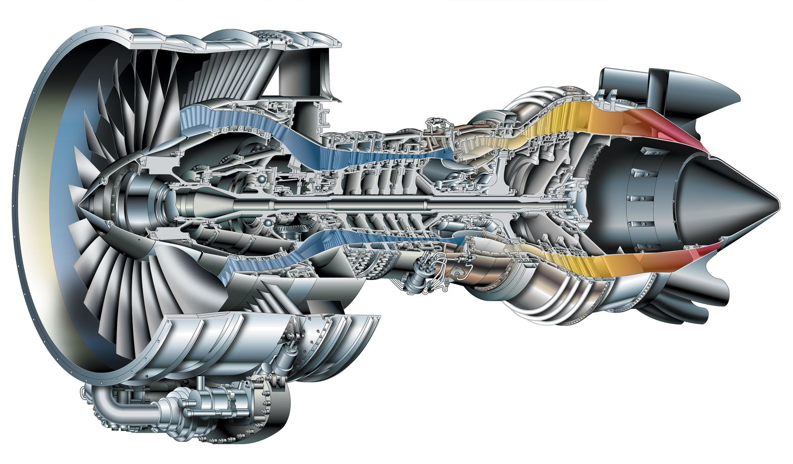
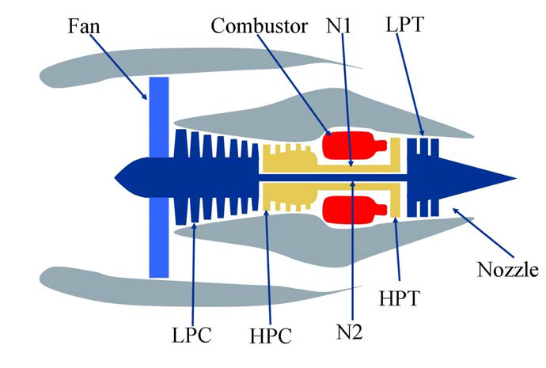

# Jet Enginge Remaining Useful Life
## Data Science Bootcamp
## Casptone Project
---



## Overview

The main goal of this document is to provide an approach to the implementaion of a model that can be use to predict the the Remaining Useful Life of a series of Jet Engines the dataset used for this project has been obtained from a NASA public available source [^1]  

The dataset consists in 3 diferent files:
- RUL_FD001.txt
- test_FD001.txt
- train_FD001.txt

In this dataset there are 100 Jet Engines, data has been collected using 21 diferent sensors located at the main components, each data collection is represented by a single use cycle. In the data has been collected for each engine from the first cycle until it reaches a failure, therefore the data in the train_FD001 file assumes that the last cycle listed per engine is the cycle when the engine suffered a major breakdown. Data is also complemented with 2 Operational Settings that are supposed to affect the engine performance.

In the test_FD001 file the data for operational settings and sensor is provided however the last cycle number doesn't represent the failure cycle, the real cycle number for each engine on the test set is provided by the file RUL_FD001. All engines are the same model.



---
#### Research Question
In the asset maintenance world predictive maintenance is gaining more importance because Implementing a predictive maintenance programme can result in:

- Savings of 30-40 percent
- 10-fold return on investment (ROI)
- Maintenance cost reduction of 25-30 percent
- Breakdown elimination of up to 75 percent
- Reduction in downtime from 35-45 percent
- Increase in production of 20-25 percent. A manufacturer has the ability to shift from reactive maintenance to dispatch a technician with a preventive maintenance work order on an 'as needed' basis and ensure that repair parts are in inventory prior to downtime. [^2]


Given the data provided in the datasets, we'd like to create a model to predict the RUL (Remaining Useful Life). In consequence we will try to answer the following question:

>**Is it possible to predict the RUL of same model Jet Engines based on Operational Setting and sensor collected data?**
---
```{r setup, include=FALSE}
knitr::opts_chunk$set(echo = TRUE)
```

```{r Library Load, include=FALSE}
# Install Packages
install.packages('corrplot')
install.packages('psych')

# Load Libraries
library(tidyverse)
library(dbplyr)
library(lubridate)
library(data.table)
library(ggplot2)
library(repr)
library(caret)
library(chron)
library(gridExtra)
library(randomForest)
library(MLmetrics)
library(MASS)
library(ROCR)
library(pROC)
library(modeest)
library(corrplot)
library(psych)
```

Loading Datasets and Formating columns

```{r Load and format datasets}
# Load Dataset for Study
test <- read_delim("test_FD001.txt", delim = " ", col_names = FALSE)
train <- read_delim("train_FD001.txt", delim = " ", col_names = FALSE)
CTF <- read_csv("RUL_FD001.txt", col_names = FALSE)

# Set header Names for Train set
names(train) <- c('UnitNum','TimeCycles','OperSet1','OperSet2','OperSet3','SensorRead01','SensorRead02','SensorRead03','SensorRead04','SensorRead05'
                  ,'SensorRead06','SensorRead07','SensorRead08','SensorRead09','SensorRead10','SensorRead11','SensorRead12','SensorRead13','SensorRead14'
                  ,'SensorRead15','SensorRead16','SensorRead17','SensorRead18','SensorRead19','SensorRead20','SensorRead21','CyclesToFail')

# Set header Names for Test set
names(test) <- c('UnitNum','TimeCycles','OperSet1','OperSet2','OperSet3','SensorRead01','SensorRead02','SensorRead03','SensorRead04','SensorRead05'
                 ,'SensorRead06','SensorRead07','SensorRead08','SensorRead09','SensorRead10','SensorRead11','SensorRead12','SensorRead13','SensorRead14'
                 ,'SensorRead15','SensorRead16','SensorRead17','SensorRead18','SensorRead19','SensorRead20','SensorRead21','CyclesToFail')

# Set header Names for RUL number applicable to Test set
names(CTF) <- c('CyclesToFail')

summary(train)
```
From the summary of the train data we can notice that:
- There are a few of the variables comming in the train data that won't add any value to the prediction mode and can be safely removed as described below.

    | Section | Variable | Reason |
    |---      | ----     | ---    |
    |Sensor Readings |SensorRead01 | Value won't change over time
    |Sensor Readings |SensorRead05 | Value won't change over time
    |Sensor Readings |SensorRead10 | Value won't change over time
    |Sensor Readings |SensorRead16 | Value won't change over time
    |Sensor Readings |SensorRead18 | Value won't change over time
    |Sensor Readings |SensorRead19 | Value won't change over time
    |Operating Settings | OperSet3 | Value won't change over time

A plot chart of the variables described above can be accessed by clicking in the links below:
[Plot of Sensor Reading Variables](https://public.tableau.com/profile/freddy.anato4039#!/vizhome/DataScience-Capstone/PlotofSensorReadings?publish=yes)
[Plot of Operational Seettings](https://public.tableau.com/profile/freddy.anato4039#!/vizhome/DataScience-Capstone/PlotofOperationSettings?publish=yes)

The initial variable reduction helps with the creation of a more fitted model which results benefitial as the inital model won't spend resources looking variables that won't produce valuable results.
 

[^1]: A. Saxena and K. Goebel (2008). "Turbofan Engine Degradation Simulation Data Set", NASA Ames Prognostics Data Repository (http://ti.arc.nasa.gov/project/prognostic-data-repository), NASA Ames Research Center, Moffett Field, CA

[^2]: What are Predictive Analytics and how important are they to effective Asset Management? (https://www.processindustryforum.com/article/predictive-analytics-important-effective-asset-management)
